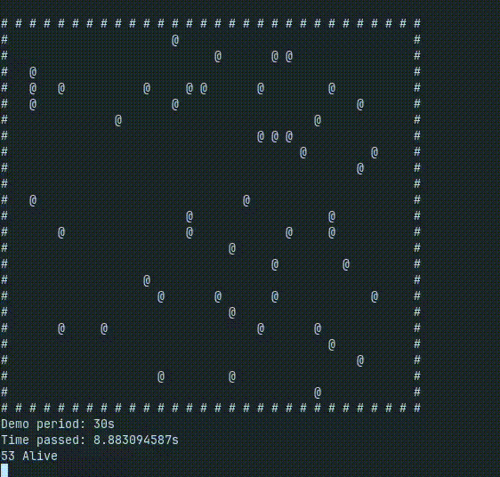

# Particle System in Rust

This is my first particle system built in Rust, inspired by Primeagen's stream.

## Demo



## Features
- Particle movement simulation
- Customizable parameters
- Optimized rendering

## Installation
```sh
cargo build --release
```

## Usage
```sh
cargo run --release
```

## License
MIT
